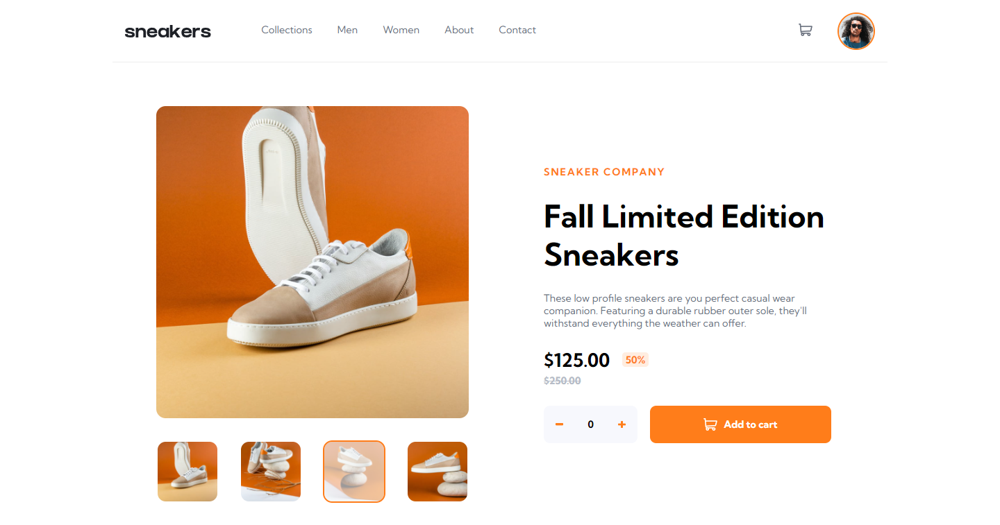

# Frontend Mentor - E-commerce product page solution

This is a solution to the [E-commerce product page challenge on Frontend Mentor](https://www.frontendmentor.io/challenges/ecommerce-product-page-UPsZ9MJp6). Frontend Mentor challenges help you improve your coding skills by building realistic projects.

## Table of contents

- [Cover](#Cover)
- [Container](#Container__Card)
  - [Container\_\_Menu](#Container__Menu)
  - [Container\_\_Cart](#Container__Cart)
  - [Container\_\_Modal](#Container__Modal)
  - [Container\_\_Header](#Container__Header)
  - [Container\_\_Product](#Container__Product)

### Screenshot

### Links

- Solution URL: [Solution](https://github.com/iElvisJosue/Frontend_Mentor_Challenges/tree/main/ecommerce-product-page-main)
- Live Site URL: [Page](https://ielvisjosue.github.io/Frontend_Mentor_Challenges/ecommerce-product-page-main)

### Built with

- Semantic HTML5 markup
- CSS custom properties
- Flexbox
- CSS Grid
- JS

## Author

- Website - [Elvis - Portfolio](https://ielvisjosue.github.io/Portafolio/)
- Frontend Mentor - [@iElvisJosue](https://www.frontendmentor.io/profile/iElvisJosue)
- Twitter - [@\_WebDevJr](https://twitter.com/_WebDevJr)
