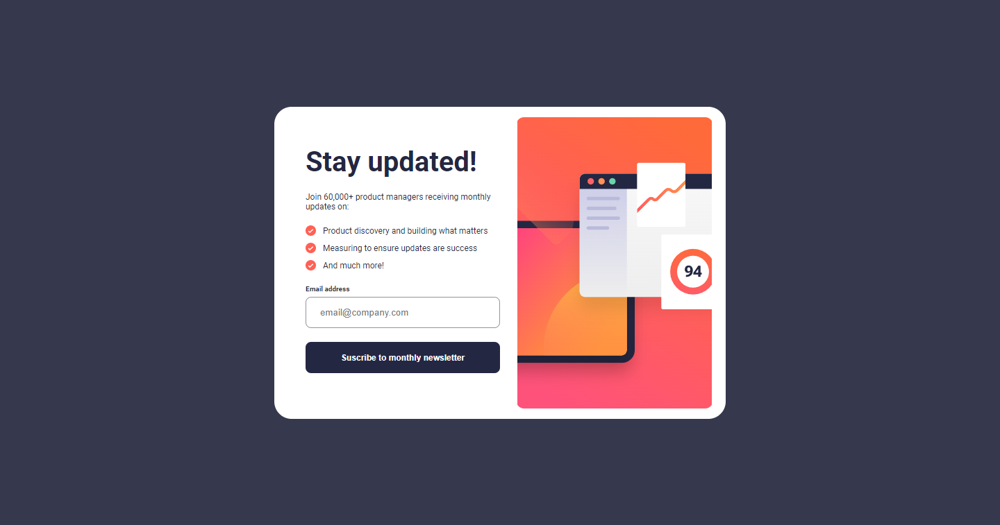

# Frontend Mentor - QR code component solution

This is a solution to the [QR code component challenge on Frontend Mentor](https://www.frontendmentor.io/challenges/qr-code-component-iux_sIO_H). Frontend Mentor challenges help you improve your coding skills by building realistic projects.

## Table of contents

- [Container](#Container)
  - [Container\_\_Card](#Container__Card)
    - [Container\_\_Card-Form](#Container__Card-Form)
      - [Form-Title](#Form-Title)
      - [Form-SubTitle](#Form-SubTitle)
      - [Form-Details](#Form-Details)
      - [Form-CheckEmail](#Form-CheckEmail)
      - [Form-Button](#Form-Button)
  - [Container\_\_Card](#Container__Modal)
    - [Container\_\_Modal-Content](#Container__Modal-Content)
      - [Container\_\_Modal-Title](#Container__Modal-Title)
      - [Container\_\_Modal-Text](#Container__Modal-Text)
    - [Container\_\_Modal-Button](#Container__Modal-Button)

## Overview

### Screenshot

### Links

- Solution URL: [Solution](https://github.com/iElvisJosue/FrontEnd-Mentor-Challenges/tree/main/newsletter-sign-up-with-success-message-main)
- Live Site URL: [Page](https://ielvisjosue.github.io/FrontEnd-Mentor-Challenges/newsletter-sign-up-with-success-message-main/)

## My process

### Built with

- Semantic HTML5 markup
- CSS custom properties
- Flexbox
- CSS Grid
- JS

## Author

- Website - [Elvis - Portfolio](https://ielvisjosue.github.io/Portafolio/)
- Frontend Mentor - [@iElvisJosue](https://www.frontendmentor.io/profile/iElvisJosue)
- Twitter - [@\_WebDevJr](https://twitter.com/_WebDevJr)
