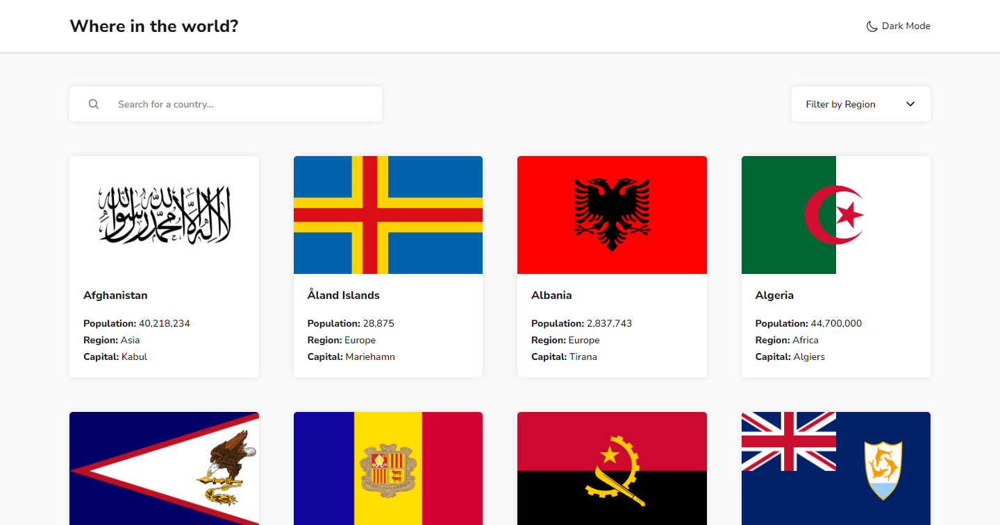

# Frontend Mentor - REST Countries API with color theme switcher solution

This is a solution to the [REST Countries API with color theme switcher challenge on Frontend Mentor](https://www.frontendmentor.io/challenges/rest-countries-api-with-color-theme-switcher-5cacc469fec04111f7b848ca). Frontend Mentor challenges help you improve your coding skills by building realistic projects.

## Table of contents

- [Container](#Container)
  - [Container\_\_Header](#Container__Header)
  - [Container\_\_Inputs](#Container__Inputs)
  - [Container\_\_Content](#Container__Content)
  - [Container\_\_Countrie](#Container__Countrie)

## Overview

### Screenshot

### Links

- Solution URL: [Solution](https://github.com/iElvisJosue/Frontend_Mentor_Challenges/tree/main/rest-countries-api-with-color-theme-switcher-main)
- Live Site URL: [Page](https://ielvisjosue.github.io/Frontend_Mentor_Challenges/rest-countries-api-with-color-theme-switcher-main/)

## My process

### Built with

- Semantic HTML5 markup
- CSS custom properties
- Flexbox
- CSS Grid
- JS
- API

## Author

- Website - [Elvis - Portfolio](https://ielvisjosue.github.io/Portafolio/)
- Frontend Mentor - [@iElvisJosue](https://www.frontendmentor.io/profile/iElvisJosue)
- Twitter - [@\_WebDevJr](https://twitter.com/_WebDevJr)

### Useful resources

- [Ionicons](https://ionic.io/ionicons) - This tool gave me the icons. Super useful!
