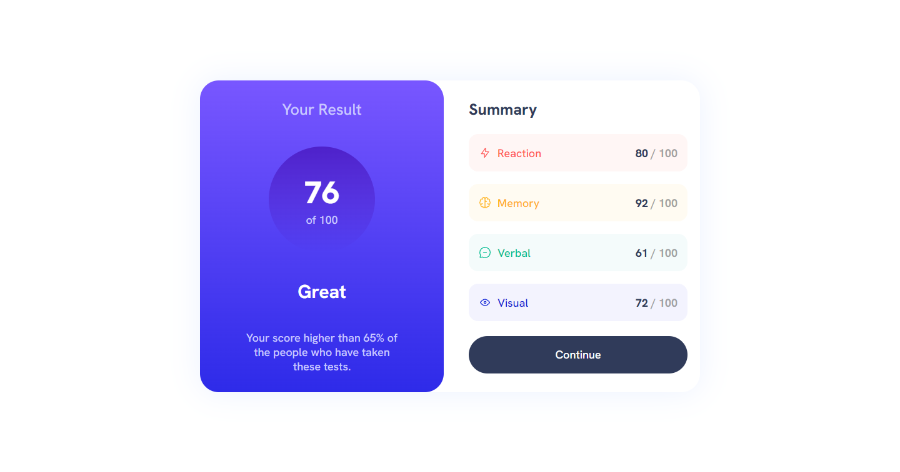

# Frontend Mentor - Results summary component

This is a solution to the [Results summary component](https://www.frontendmentor.io/challenges/results-summary-component-CE_K6s0maV). Frontend Mentor challenges help you improve your coding skills by building realistic projects.

## Table of contents

- [Container](#Container)
  - [Container\_\_Card](#Container__Card)
    - [Container\_\_Card-Left](#Container__Card-Left)
    - [Container\_\_Card-Right](#Container__Card-Right)

## Overview

### Screenshot

### Links

- Solution URL: [Solution](https://github.com/iElvisJosue/FrontEnd-Mentor-Challenges/tree/main/results-summary-component-main)
- Live Site URL: [Page](https://ielvisjosue.github.io/FrontEnd-Mentor-Challenges/results-summary-component-main)

## My process

### Built with

- Semantic HTML5 markup
- CSS custom properties
- Flexbox
- CSS Grid
- JS

## Author

- Website - [Elvis - Portfolio](https://ielvisjosue.github.io/Portafolio/)
- Frontend Mentor - [@iElvisJosue](https://www.frontendmentor.io/profile/iElvisJosue)
- Twitter - [@\_WebDevJr](https://twitter.com/_WebDevJr)
